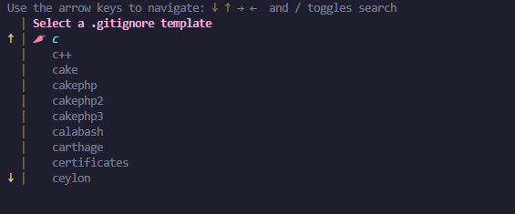
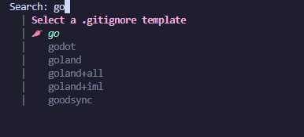

# gogn

Simple no-frills .gitignore generator backed by [gitignore.io][gitignoreio].



## Install

```console
go install github.com/onyx-and-iris/gogn@latest
```

## Configuration

*flags*

-   --height/-H: Height of the selection prompt (default 10)
-   --filter/-f: Type of filter to apply to the list of templates (default startswith)
    -   may be one of (startswith, contains)
-   --start-search/-s: Start the prompt in search mode (default false)

*environment variables*

```bash
#!/usr/bin/env bash

export GOGN_HEIGHT=10
export GOGN_FILTER=startswith
export GOGN_START_SEARCH=false
```

## Commands

### New

Trigger the selection prompt.

```console
gogn new
```

Search mode can be activated by pressing `/`:



## Special Thanks

-   [spf13](https://github.com/spf13) for the [cobra](https://github.com/spf13/cobra) and [viper](https://github.com/spf13/viper) packages.
-   [Manifold](https://github.com/manifoldco) for the [promptui](https://github.com/manifoldco/promptui) package.


[gitignoreio]: https://www.toptal.com/developers/gitignore